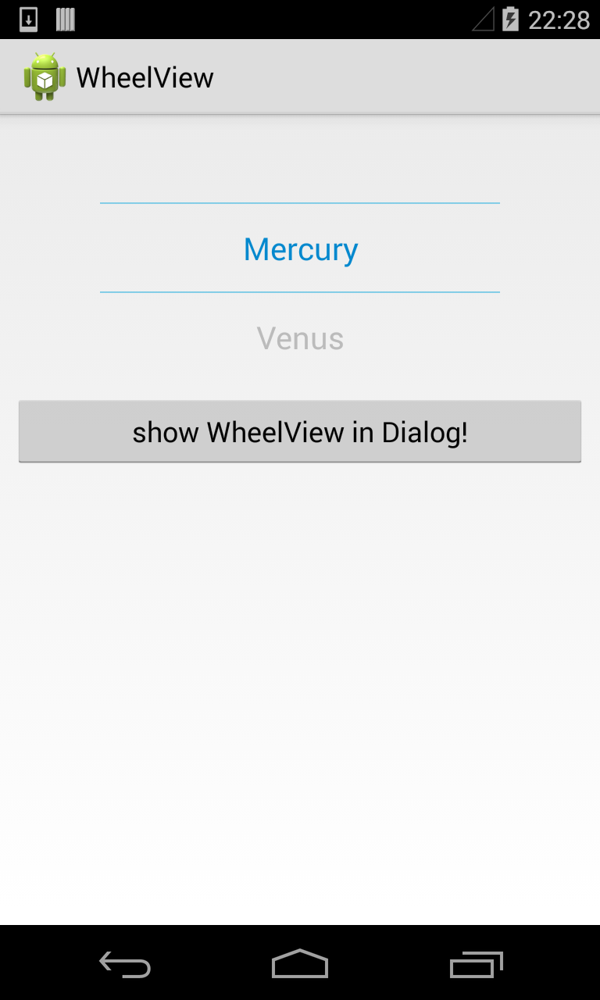
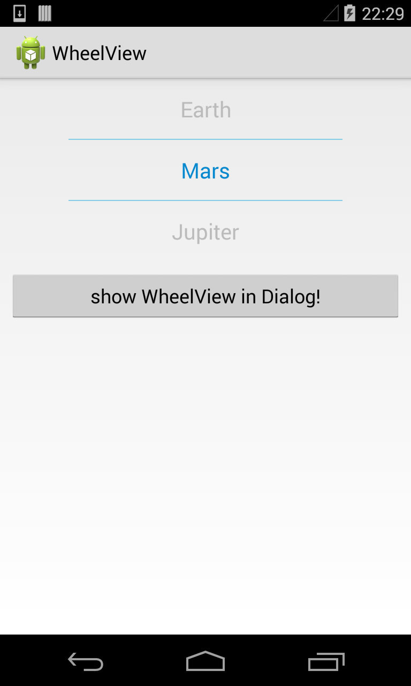
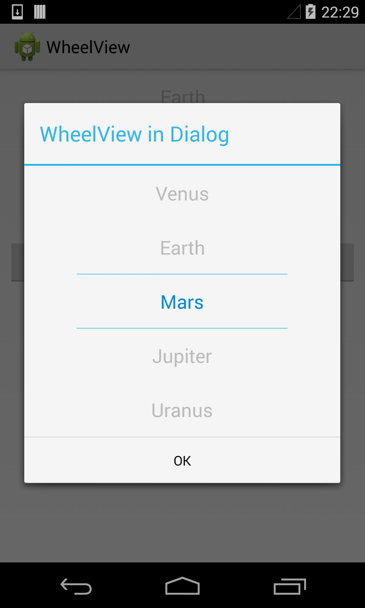

WheelView
=========





### How to use

#### layout: 
```xml
<com.wangjie.wheelview.WheelView
        android:id="@+id/main_wv"
        android:layout_width="match_parent"
        android:layout_height="wrap_content"
    />
```

#### Activity: 

```java    
WheelView wva = (WheelView) findViewById(R.id.main_wv);
wva.setOffset(1);
wva.setItems(Arrays.asList(PLANETS));
wva.setOnWheelViewListener(new WheelView.OnWheelViewListener() {
    @Override
    public void onSelected(int selectedIndex, String item) {
        Log.d(TAG, "selectedIndex: " + selectedIndex + ", item: " + item);
    }
});
```

#### Show in dialog: 

```java
View outerView = LayoutInflater.from(this).inflate(R.layout.wheel_view, null);
WheelView wv = (WheelView) outerView.findViewById(R.id.wheel_view_wv);
wv.setOffset(2);
wv.setItems(Arrays.asList(PLANETS));
wv.setSeletion(3);
wv.setOnWheelViewListener(new WheelView.OnWheelViewListener() {
    @Override
    public void onSelected(int selectedIndex, String item) {
        Log.d(TAG, "[Dialog]selectedIndex: " + selectedIndex + ", item: " + item);
    }
});

new AlertDialog.Builder(this)
        .setTitle("WheelView in Dialog")
        .setView(outerView)
        .setPositiveButton("OK", null)
        .show();
```
    
License
=======

    Copyright 2014 Wang Jie

    Licensed under the Apache License, Version 2.0 (the "License");
    you may not use this file except in compliance with the License.
    You may obtain a copy of the License at

       http://www.apache.org/licenses/LICENSE-2.0

    Unless required by applicable law or agreed to in writing, software
    distributed under the License is distributed on an "AS IS" BASIS,
    WITHOUT WARRANTIES OR CONDITIONS OF ANY KIND, either express or implied.
    See the License for the specific language governing permissions and
    limitations under the License.


[](https://android-arsenal.com/details/1/1433)
